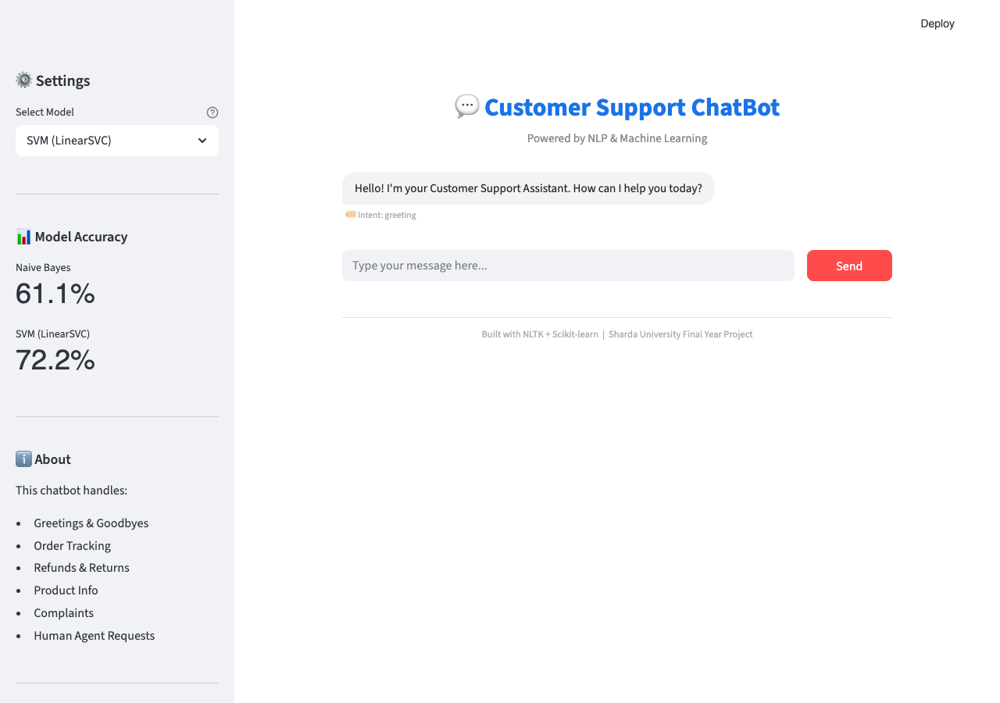
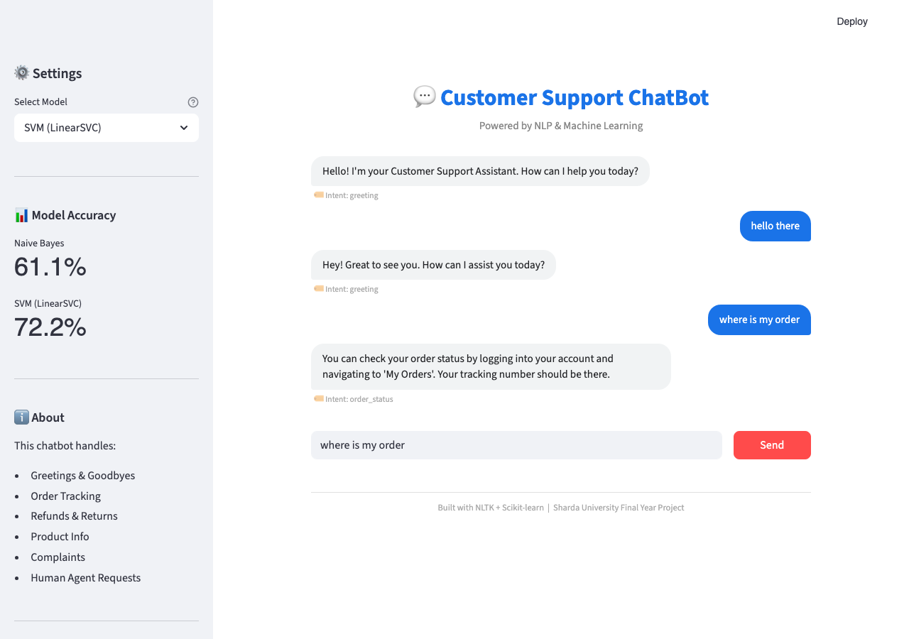
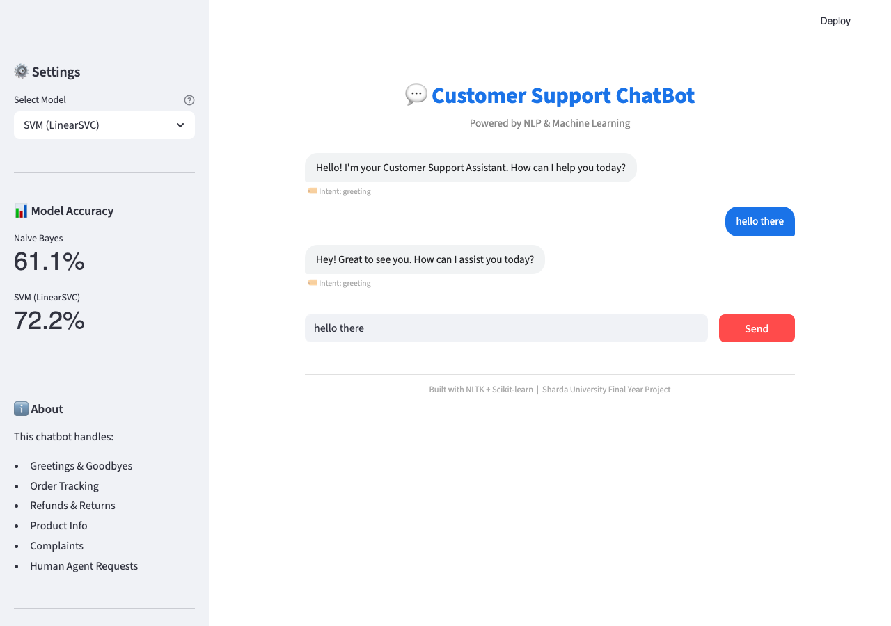
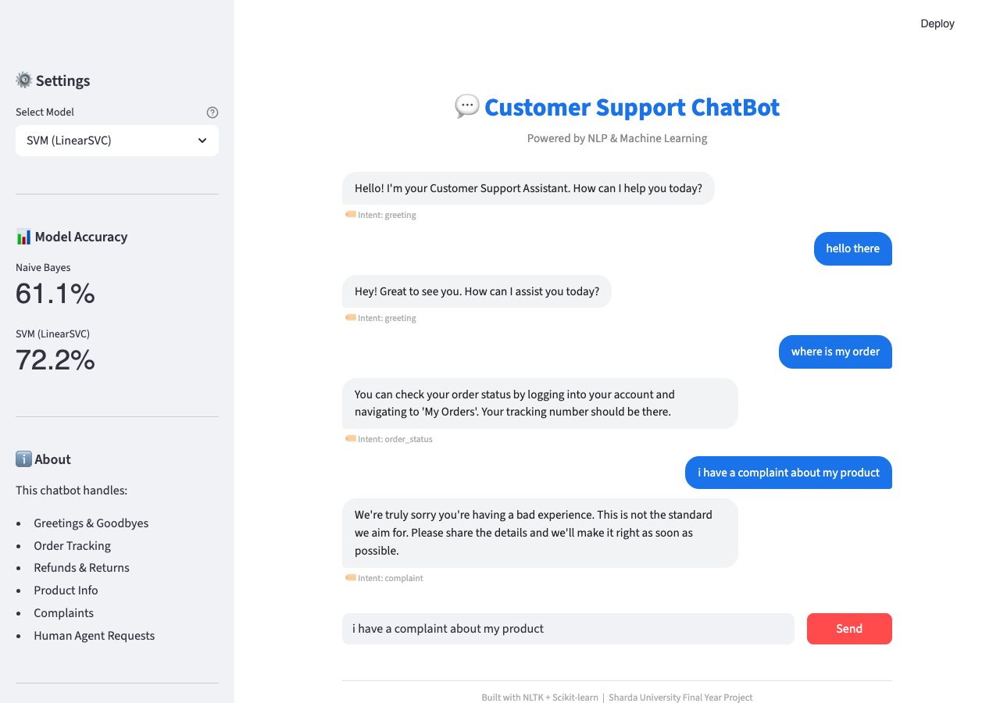

<div align="center">
  <h1>🤖 Customer Support Chatbot </h1>
  <p>An intelligent, ML-powered customer service assistant built with NLTK, Scikit-learn, and Streamlit.</p>
</div>

---

## 📌 Overview
This project is an end-to-end Machine Learning chatbot designed to automate customer support interactions. It trains **two distinct ML classifiers** (Naive Bayes and Support Vector Machines) on a custom dataset of conversational intents, providing a modern and clean chat interface for real-time interactions.

### 🌟 Key Features
- **Dual ML Engine**: Instantly switch between `Naive Bayes` and `LinearSVC` models to compare accuracy and response styles.
- **NLP Preprocessing Pipeline**: Built-in tokenization, stopword removal, and lemmatization using NLTK and TF-IDF feature extraction.
- **Dynamic Training**: The application auto-trains on the first launch and allows for easy retraining via a standalone script.
- **Persistent Chat Interface**: A beautiful, session-aware UI built entirely in Streamlit with styled sender/receiver chat bubbles.
- **Transparency**: Real-time display of the detected intent and engine confidence score beneath each bot response.

---

## 📸 Screenshots

| Main Interface | Order Tracking |
| :---: | :---: |
|  |  |

| Greeting Flow | Complaint Handling |
| :---: | :---: |
|  |  |

---

## 💻 Tech Stack
- **Language**: Python 3.8+
- **NLP & Processing**: `NLTK`, `Scikit-learn`
- **Models**: `MultinomialNB`, `LinearSVC`
- **Frontend / Web UI**: `Streamlit`
- **Serialization**: `pickle`

---

## 🚀 Quick Start

### 1. Install Dependencies
```bash
pip install -r requirements.txt
```

### 2. Train the Models
*(Optional) If you modify `data/intents.json`, you can retrain the models directly:*
```bash
python train.py
```

### 3. Launch the Application
```bash
streamlit run app.py
```
> The application will automatically open in your default browser at `http://localhost:8501`.

---

## 🧠 Supported Intents
The model is currently trained to handle a variety of realistic customer service flows:

| Intent Type | Example Queries |
|---|---|
| **Greeting** | `"hi"`, `"hello"`, `"good morning"` |
| **Goodbye** | `"bye"`, `"see you later"`, `"farewell"` |
| **Thanks** | `"thank you"`, `"appreciate it"` |
| **Order Status** | `"where is my order"`, `"track my package"` |
| **Refunds** | `"i want a refund"`, `"return policy"` |
| **Product Info** | `"what do you sell"`, `"product details"` |
| **Complaints** | `"i have a complaint"`, `"bad experience"` |
| **Human Handoff** | `"talk to human"`, `"connect me to agent"` |

---
*Created as an academic Capstone / Final Year Project demonstrating real-world Applied Machine Learning & NLP.*
